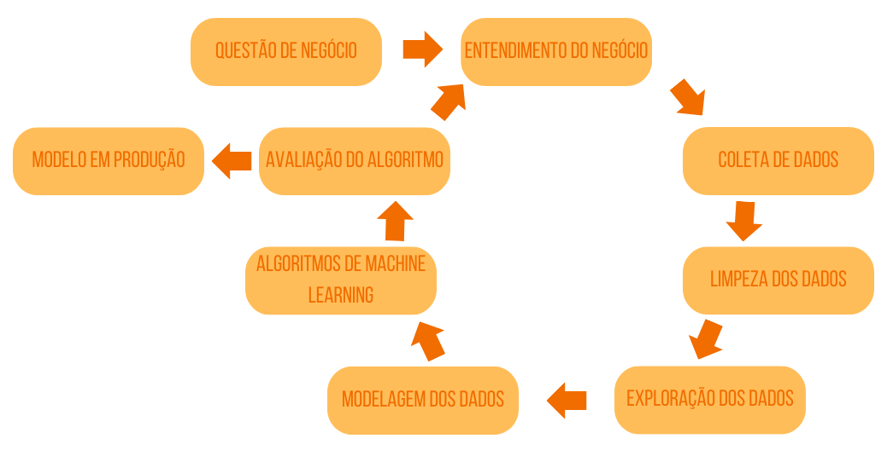

# Rossmann - Previsão de Vendas

O projeto consiste em desenvolver um sistema de previsão de vendas para a rede de farmácias Rossmann, que possui mais de 4.000 lojas em 8 países da Europa. A previsão será realizada por meio de um bot no aplicativo de mensagens Telegram, permitindo que os usuários consultem a previsão de vendas das próximas 6 semanas para uma determinada loja, utilizando o código correspondente.

Anteriormente, a previsão de vendas era realizada manualmente por cada gerente de loja, resultando em um processo demorado e descentralizado. Com a implementação desse sistema automatizado, o CFO da Rossmann busca centralizar as informações e agilizar o processo de previsão, garantindo dados mais precisos e confiáveis.

O bot no Telegram será capaz de fornecer aos usuários uma estimativa das vendas futuras com base em dados históricos, fatores sazonais e outros dados relevantes. Isso permitirá que a equipe de gerenciamento da Rossmann tome decisões estratégicas.

## Planejamento da Solução
Usaremos o método cíclico de desenvolvimento CRISP-DS. 

<b> Entendimento do Negócio</b> 
Entender o que foi pedido, porque foi pedido, qual o objetivo pra isso, como vai ser feita a entrega da solução.

<b> Coleta de Dados</b> 
Identificar, avaliar e adquirir os dados necessários.

<b> Limpeza dos Dados</b>
* Descrição dos Dados
    * Renomear Colunas
    * Dimensão dos Dados
    * Tipos de Dados
    * Checar dados faltantes
    * Preencher dados faltantes
    * Mudar tipos de dados
    * Estatística Descrititva

<b> Exploração dos Dados</b>
* Feature Engineering
    * Mapa mental de hipóteses
    * Criação de hipóteses
        * Hipoteses Loja
        * Hipoteses Produto
        * Hipoteses Tempo
    * Derivar variáveis
* Filtragem de variáveis
    * Filtragem de linhas
    * Seleção de colunas
* Análise Exploratória
    * Análise Univariada
        * Variável resposta
        * Variáveis numéricas
        * Variáveis categóricas
    * Análise Bivariada
    * Análise Multivariada
        * Atributos numéricos
        * Atributos categóricos

<b> Modelagem dos Dados</b>
* Preparação dos Dados
    * Rescaling
    * Transformação
        * Encoding
        * Response variable transformation
        * Nature Transformation
* Seleção de atributos
    * Separar dataframe em treino e test
    * Selecionar features com Boruta

<b> Algoritmo de Machine Learning</b>
* Average Model
* Linear Regression
* Linear Regression Regularized Model - Lasso
* Random Forest Regressor
* XGBoost Regressos
* Comparação da performace dos Modelos
* Fine Tuning
    * Random Search

<b> Avaliação do Algoritmo</b>
* Tradução e interpretação do Erro
    * Business Performance
    * Total Performance
    * Machine Learning Performance

<b> Modelo em Produção</b>
* Rossmann Class
* API Handler
* API Tester

### Ferramentas utilizidas
<b> Linguagem de programção:</b> Python  
<b>Ambiente de desenvolvimento:</b> Jupyter Notebook, VSCode 
<b>Ferramenta de controle de versão:</b> Git 
<b>Hospedagem em Nuvem:</b> Render 
<b>Bibliotecas:</b> Pandas, Numpy, Inflection, Seaborn, Matplotlib, XGBoost, Pickle, Scipy, Skit 
<b>Framework:</b> Flask 

## Próximos Passos:
* Melhorar as métricas do modelo
* No próximo ciclo utilizar outros algoritmos com o intuito de melhorar o desempenho da previsão
* Analisar as vendas por semestre, como o dataset as vendas vão até metade de 2015.
* Melhorar usabilidade do bot no Telegram
